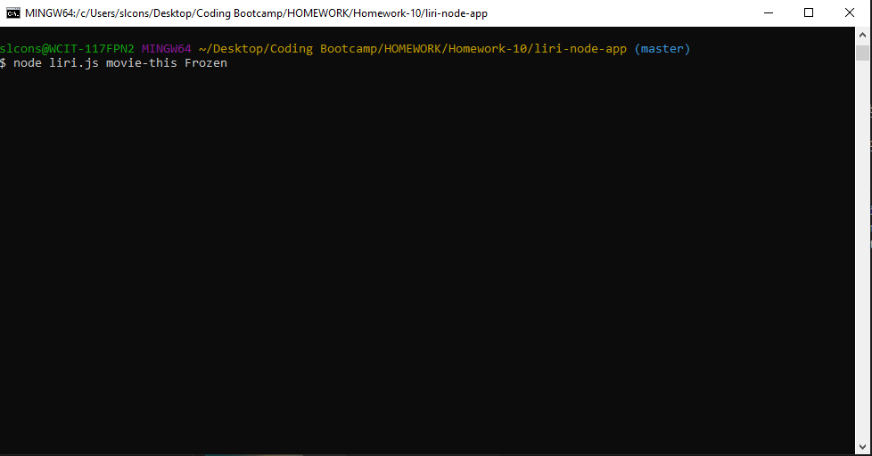
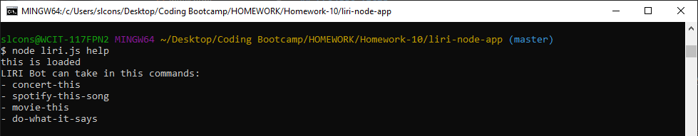
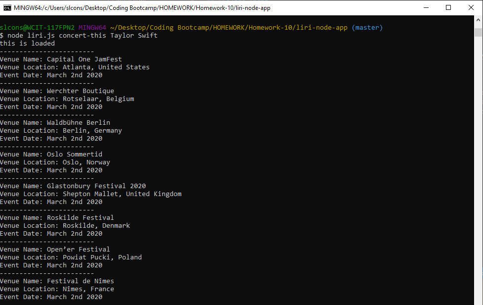
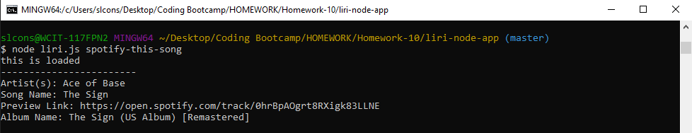
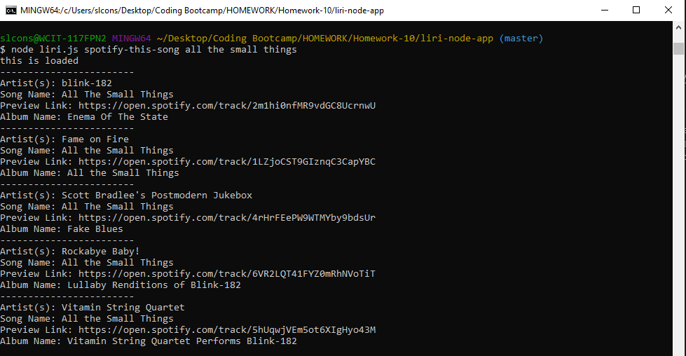
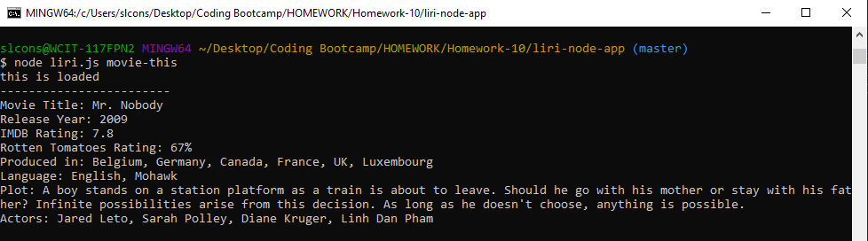
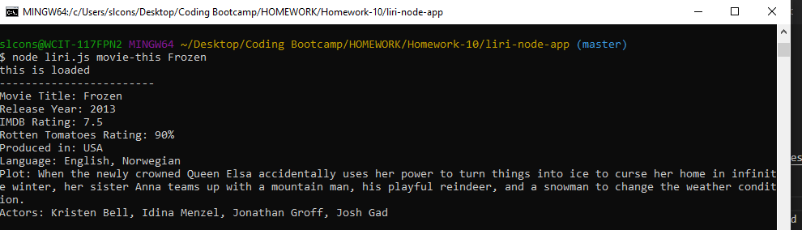
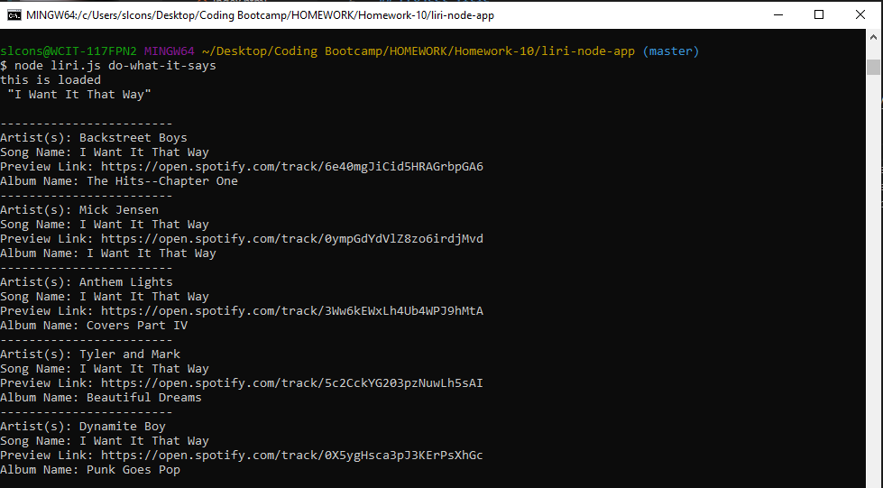

# LIRI Bot
## Created By
Created by Samantha Considine. Sole developer. 

## About
LIRI Bot takes in 5 commands (command) and a user search input (userInput) from the command line. Depending on the command given, LIRI Bot takes the userInput and returns data. The commands are as follows:

* help
* concert-this
* spotify-this-song
* movie-this
* do-what-it-says

### help
This command will list out all the other commands that the user can input. 

### concert-this
This command will search for upcoming concerts for a user inputted artist who is on tour through the Bands in Town API using Axios. Results will include the venue's name and location as well as the event date. 

### spotify-this-song
This command will search for a song through the node-spotify-api. It will return up to 5 results for a given song. Each result will have the associated artist, song name, Spotify preview link, and song's album. 

If a song is not supplied by the user, LIRI Bot will provide data on the song "The Sing" by Ace of Base.

### movie-this
This command will search for a movie through the OMDB API using Axios. The result will include the movie's title, release year, IMDB rating, Rotten Tomatoes rating, country it was produced in, language, plot, and actors list. 

If a movie is not supplied by the user, LIRI Bot will provide data on the movie Mr.Nobody. 

### do-what-it-says
This command will take the text from the random.txt file and use it to run a search. The text document will include a command as well as a user input. Once LIRI Bot reads that information, it will run the approprite command function with the coordinating userInput. 

## Instructions
With the files accessible in the terminal run the following in the command line:
'node liri.js [put-the-command-here] [put-your-user-search-input-here]'

## See it in action!!

### help
Put help in as the command in the terminal.

### concert-this
Searched Taylor Swift's upcoming tour dates using the concert-this command.

### spotify-this-song 
Used the spotify-this-song command with no user input. 

Searched All the Small Things on Spotify using the spotify-this-song command.

### movie-this
Used the movie-this command with no user input. 

Searched Frozen on OMDB using the movie-this command. 

### do-what-it-says
Ran the do-what-it says command. The random.txt file read 'spotify-this-song, "I Want It That Way"'. 

## Technology Used
* JavaScript
* Node.js
* APIs: 
    - OMDB 
    - Bands in Town
* npm packages: 
    - node-spotify-api
    - axios

